# System Patterns: Website Structure Guide

## Website Architecture

This template follows a modern, component-based architecture optimized for e-commerce and artisanal product showcase:

```mermaid
flowchart TD
    A[Landing Page Structure] --> B[Hero Section]
    A --> C[Featured Collections]
    A --> D[Scent Explorer]
    A --> E[Customer Reviews]
    A --> F[Newsletter & Footer]
    
    G[Design System] --> H[Black & Silver Palette]
    G --> I[Magazine Typography]
    G --> J[Elegant Components]
    
    K[Animation System] --> L[Soft Scroll Effects]
    K --> M[Hover Reveals]
    K --> N[Smooth Transitions]
    
    O[E-commerce Features] --> P[Product Grid]
    O --> Q[Shopping Cart]
    O --> R[Scent Finder Quiz]
```



## Website Sections & Purpose

### 1. Hero Section
The dramatic opening that showcases @NoxBoutique's artisanal candle collections and luxury aesthetic.

**Purpose**:
- Immediately convey the handcrafted, luxury nature of products
- Create an intimate, sophisticated first impression
- Guide visitors to explore collections or featured products
- Establish the elegant, minimalist brand identity

**Recommended Elements**:
- Striking headline: "Handcrafted Candles for Every Moment"
- Supporting subheadline highlighting artisanal quality and unique scents
- "Explore Collections" primary call-to-action button
- Cinematic background showcasing candle-making process or featured product
- Floating navigation bar with category filters and mini-cart

### 2. Featured Collections Section
Showcases curated candle collections with scent profiles and seasonal offerings.

**Purpose**:
- Present product variety through themed collections
- Help customers discover scents that match their preferences
- Highlight seasonal and limited-edition offerings
- Drive traffic to specific product categories

**Recommended Elements**:
- 3-4 featured collections with lifestyle imagery
- Scent family descriptions (woody, floral, citrus, spice)
- Collection names with brief, evocative descriptions
- "Shop Collection" buttons with hover effects revealing quick-view options
- Masonry grid layout showcasing product photography

### 3. Scent Exploration Guide
Interactive section helping customers discover their perfect candle based on preferences and occasions.

**Purpose**:
- Educate customers about different scent profiles
- Reduce decision paralysis with guided recommendations
- Showcase expertise in fragrance curation
- Create an engaging, interactive shopping experience

**Recommended Elements**:
- Scent finder quiz with mood and occasion-based questions
- Visual scent wheel or guide showing fragrance families
- "Find Your Scent" interactive tool
- Featured scent of the month with detailed tasting notes
- Tips for candle care and optimal burning

### 4. Customer Reviews & Testimonials
Social proof showcasing customer experiences with @NoxBoutique candles.

**Purpose**:
- Build trust through authentic customer feedback
- Highlight product quality and customer satisfaction
- Address common questions about scent longevity and quality
- Show real-world usage and gift-giving experiences

**Recommended Elements**:
- Customer photos featuring candles in their homes
- Detailed reviews mentioning specific scents and burn quality
- Star ratings and verified purchase indicators
- Gift recipient testimonials
- Featured review carousel with elegant transitions

### 5. Newsletter & Sustainability Commitment
Engagement section highlighting company values and encouraging ongoing connection.

**Purpose**:
- Build email list for marketing and customer retention
- Communicate brand values around sustainability and craftsmanship
- Provide exclusive access to new releases and sales
- Reinforce the artisanal, conscious brand positioning

**Recommended Elements**:
- Newsletter signup with incentive (10% off first order)
- Sustainability commitments (soy wax, recycled packaging)
- Behind-the-scenes glimpse of candle-making process
- "Join the Nox Community" call-to-action
- Social media integration showcasing @NoxBoutique content

### 6. Footer
Comprehensive information hub supporting customer service and brand transparency.

**Purpose**:
- Provide essential business and contact information
- Offer additional navigation and support options
- Include legal requirements and policies
- Reinforce brand presence across social platforms

**Recommended Elements**:
- Nox Boutique contact details and customer service hours (Monday-Friday 9am-6pm EST)
- Email: alla@nox.boutique and Phone: (888) 555-0197
- Shipping address: 456 Artisan Way, Suite 201, Brooklyn, NY 11201
- Social media links to @NoxBoutique
- Care guides, shipping policies, and return information
- Newsletter signup and sustainability page links

## Design System Principles

### Color System

The elegant black and silver aesthetic creates a sophisticated, luxury feel:

```
Primary (Deep Black)    → Brand identity, navigation, premium actions
Secondary (Silver)      → Supporting elements, secondary navigation
Accent (Warm Gold)      → Highlights, flame imagery, special offers
Background (Pure White) → Clean canvas, product photography backdrop
Text (Charcoal/Black)   → High contrast, magazine-quality readability
```

When implementing the color system:
1. Use deep black for primary branding and navigation elements
2. Incorporate silver accents for interactive states and borders
3. Add warm gold sparingly for flame motifs and special callouts
4. Maintain white space for elegant, minimalist composition

### Typography System

Magazine-inspired typography creates sophisticated, editorial-quality content:

```
Display Headings → Elegant serif or refined sans-serif, large scale
Section Headers  → Clean, modern typography with generous spacing
Body Text       → Highly readable sans-serif for product descriptions
Accent Text     → Italic or script fonts for scent names and quotes
```

Typography implementation:
1. Choose an elegant display font for collection names and headers
2. Use clean, readable fonts for product descriptions and care instructions
3. Implement script or italic fonts for scent names and romantic descriptions
4. Maintain generous line spacing for magazine-like readability

### Animation Guidelines

Soft, smooth animations enhance the luxury shopping experience:

**Scroll Animations**:
- Gentle fade-ins as product cards enter viewport
- Smooth parallax on hero background imagery
- Progressive content reveal maintaining elegant pacing
- Subtle animations lasting 0.4-0.8 seconds for luxury feel

**Hover States**:
- Product image transitions revealing alternate views
- Gentle scaling and shadow effects on interactive elements
- Scent description overlays on product hover
- Smooth cart and wishlist icon animations

**Transitions**:
- Page transitions that maintain shopping context
- Smooth category filter animations
- Elegant modal appearances for quick-view and cart
- Seamless mobile menu sliding animations

## Section Composition Patterns

### Hero Section Patterns

**1. Cinematic Hero with Floating Navigation**
```
┌─────────────────────────────────┐
│  [Nav] [Categories] [Cart]      │
│                                 │
│    Handcrafted Luxury           │
│    Candles for Every Moment     │
│                                 │
│    [Explore Collections]        │
│                                 │
│  (Candle-making process video)  │
└─────────────────────────────────┘
```

### Featured Collections Patterns

**1. Masonry Product Grid**
```
┌───────┬─────┬───────┐
│ Fall  │ Spa │ Holiday│
│ Coll. │ Coll│ Limited│
│       ├─────┤        │
│       │ Summer     │
│       │ Collection │
└───────┴─────┴───────┘
```

**2. Scent Family Explorer**
```
┌─────────────────────────────────┐
│        Discover Your Scent      │
│                                 │
│  [Woody] [Floral] [Citrus]     │
│  [Spice] [Fresh]  [Vanilla]    │
│                                 │
│      [Take Scent Quiz]          │
└─────────────────────────────────┘
```

### Product Showcase Patterns

**1. Featured Product Spotlight**
```
┌─────────┬─────────────────────┐
│         │  Midnight Garden    │
│ Product │  Scent Notes: Rose, │
│ Image   │  Sandalwood, Musk   │
│         │  [Add to Cart]      │
└─────────┴─────────────────────┘
```

**2. Customer Review Gallery**
```
┌─────────┐ ┌─────────┐ ┌─────────┐
│ "Perfect│ │ "Lasts  │ │ "Beautiful│
│  for    │ │  all    │ │  packaging│
│  gifts" │ │  evening"│ │  & scent" │
│ - Sarah │ │ - Mike  │ │ - Emma   │
└─────────┘ └─────────┘ └─────────┘
```

## E-commerce Specific Features

### Shopping Experience Elements

**Product Quick-View Modal**:
- Hover-triggered product previews
- Scent description and notes
- Size and quantity selection
- Add to cart without leaving page

**Mini-Cart Functionality**:
- Persistent cart access in navigation
- Product thumbnails and quantities
- Quick quantity adjustment
- Estimated shipping and total

**Scent Finder Quiz**:
- Personality and preference questions
- Occasion-based recommendations
- Seasonal scent suggestions
- Direct links to recommended products

### Mobile E-commerce Considerations

**Touch-Friendly Design**:
- Large product images for detailed viewing
- Easy-to-tap add-to-cart buttons
- Swipe-enabled product galleries
- Simple checkout process

**Mobile Navigation**:
- Hamburger menu with category filters
- Search functionality with scent suggestions
- Persistent cart icon with item count
- Easy access to account and wishlist

## SEO & Performance Guidelines

**E-commerce SEO Best Practices**:
- Product schema markup for rich snippets
- Unique product descriptions highlighting scent profiles
- Category pages optimized for fragrance family keywords
- Customer review integration for fresh content
- Local SEO optimization for Brooklyn, NY location

**Performance Optimization for E-commerce**:
- Lazy loading for product image galleries
- Optimized product images with WebP format
- Fast-loading category and filter functionality
- Efficient cart and checkout page performance
- Mobile-optimized product browsing experience

**Conversion Optimization**:
- Clear product photography showcasing candle details
- Detailed scent descriptions and burning instructions
- Customer reviews and ratings prominently displayed
- Multiple payment options and secure checkout
- Shipping information and return policy clearly stated

By following these patterns, @NoxBoutique will create an elegant, user-friendly e-commerce experience that reflects the artisanal quality of handcrafted candles while driving conversions through sophisticated design and seamless functionality.
